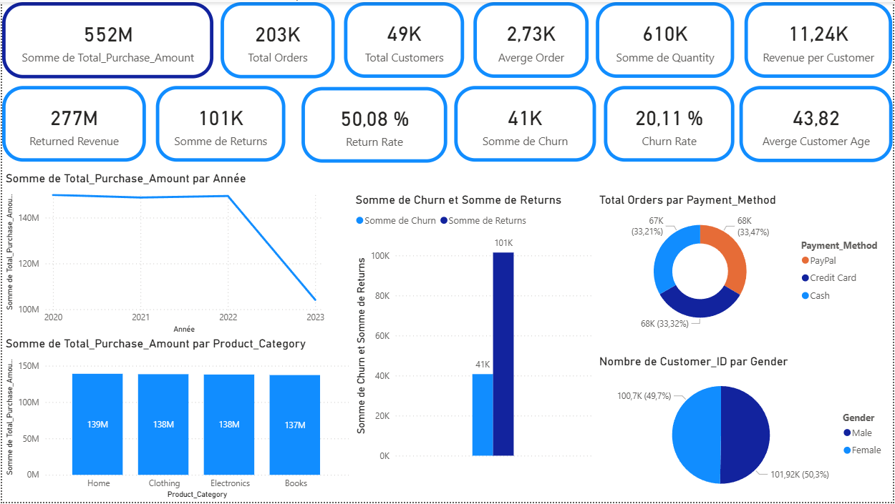
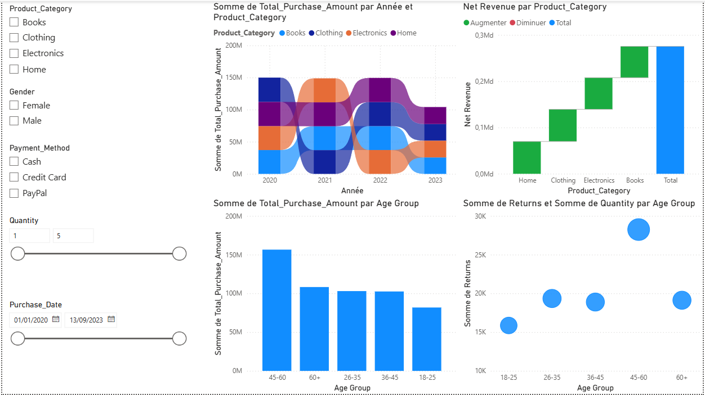
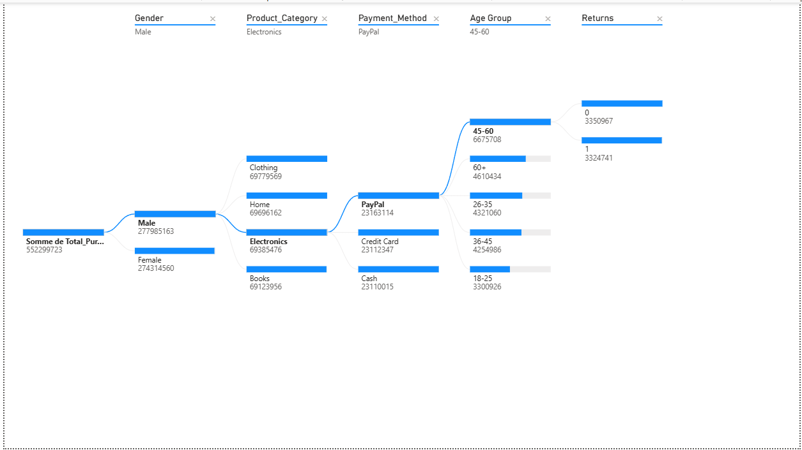

# 🛒 E-Commerce Sales Analytics — Power BI & Python


> Analyse complète d'un dataset e-commerce : nettoyage des données avec Python/Pandas, puis visualisation interactive et exploration via Power BI Desktop.

---

## 🔍 Aperçu du projet

Ce projet constitue une analyse end-to-end d'un jeu de données e-commerce synthétique. L'objectif est de transformer des données brutes en insights actionnables à travers deux phases distinctes :

1. **Nettoyage & préparation** des données avec Python (Jupyter Notebook)
2. **Visualisation & exploration** interactive avec Power BI

L'analyse couvre le comportement d'achat des clients, la performance par catégorie de produit, les modes de paiement, les taux de retour et de churn.

---

## 📦 Dataset

Le dataset contient les colonnes suivantes :

| Colonne | Description |
|---|---|
| `Customer_ID` | Identifiant unique de chaque client |
| `Customer_Name` | Nom du client (généré via Faker) |
| `Customer_Age` | Âge du client |
| `Gender` | Genre du client (Male / Female) |
| `Purchase_Date` | Date de l'achat |
| `Product_Category` | Catégorie du produit (Books, Clothing, Electronics, Home) |
| `Product_Price` | Prix unitaire du produit |
| `Quantity` | Quantité achetée |
| `Total_Purchase_Amount` | Montant total de la transaction |
| `Payment_Method` | Moyen de paiement (Cash, Credit Card, PayPal) |
| `Returns` | Retour produit (0 = non, 1 = oui) |
| `Churn` | Churn client (0 = retenu, 1 = churné) |

---

## 🐍 Partie 1 — Nettoyage des données (Python)

Le notebook `E-commerce_nettoyage.ipynb` réalise les étapes suivantes :

- **Chargement** du dataset brut avec Pandas
- **Inspection** des types de données et détection des valeurs manquantes
- **Traitement des nulls** et correction des types (dates, numériques)
- **Détection & suppression** des doublons
- **Feature engineering** : extraction de l'année, groupe d'âge (`Age_Group`), colonne `Net_Revenue`
- **Export** du dataset propre prêt pour Power BI

---

## 📊 Partie 2 — Dashboard Power BI

Le dashboard est composé de **3 pages** :

### Page 1 — Vue d'ensemble (KPIs globaux)

Vue synthétique avec les indicateurs clés de performance.



---

### Page 2 — Analyse détaillée avec filtres

Exploration interactive par catégorie, genre, mode de paiement, tranche d'âge et période.



---

### Page 3 — Arbre de décomposition

Décomposition hiérarchique du `Total_Purchase_Amount` selon les dimensions : Genre → Catégorie → Paiement → Tranche d'âge → Retours.



---

## 📈 KPIs clés

| Indicateur | Valeur |
|---|---|
| **Chiffre d'affaires total** | 552 M |
| **Total commandes** | 203 K |
| **Clients uniques** | 49 K |
| **Panier moyen** | 2 730 |
| **Revenu par client** | 11 240 |
| **Taux de retour** | 50,08 % |
| **Taux de churn** | 20,11 % |
| **Âge moyen client** | 43,82 ans |

---

## 💡 Insights & conclusions

- 👥 **Genre** : La répartition est quasi équilibrée — Male (277M) vs Female (274M), sans écart significatif de comportement d'achat.
- 🛍️ **Catégories** : Les 4 catégories (Home, Clothing, Electronics, Books) génèrent des revenus très proches (~138M chacune), indiquant une diversification stable.
- 💳 **Paiement** : Les 3 modes de paiement sont utilisés de façon homogène (~33% chacun).
- 👶 **Tranche d'âge** : Les **45-60 ans** sont le segment le plus dépensier (155M), suivis des 60+ (107M).
- 🔄 **Retours** : Le taux de retour de **50%** est anormalement élevé — nécessite une investigation approfondie (qualité produit, politique de retour...).
- 📉 **Churn** : 20% des clients ont churné. La corrélation entre retours et churn mérite d'être explorée.
- 📅 **Tendance temporelle** : Le chiffre d'affaires montre une baisse marquée en 2023, possiblement due à des données partielles sur l'année.

---

## 📁 Structure des fichiers

```
.
├── E-commerce_nettoyage.ipynb   # Preprocessing Python
├── ecommerce_dashboard.pbix     # Dashboard Power BI
├── images/
│   ├── KPI.png
│   ├── filtre.png
│   └── decomposition-tree.png
└── README.md
```

---

## 🛠 Technologies utilisées

| Outil | Usage |
|---|---|
| **Python 3** | Nettoyage et préparation des données |
| **Pandas** | Manipulation des DataFrames |
| **Jupyter Notebook** | Environnement d'analyse interactif |
| **Power BI Desktop** | Visualisation & reporting |
| **DAX** | Mesures calculées dans Power BI |
| **Faker** | Génération des données synthétiques |

---

## 👤 Auteur

**Hiba Kourda**
- GitHub : [hibakourda2025](https://github.com/hibakourda2025)
- LinkedIn : [hiba kourda](https://www.linkedin.com/in/hibakourda/)

---

